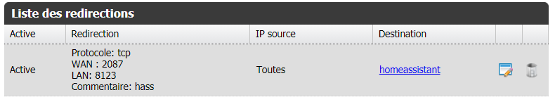
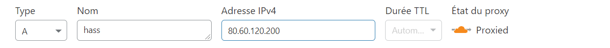
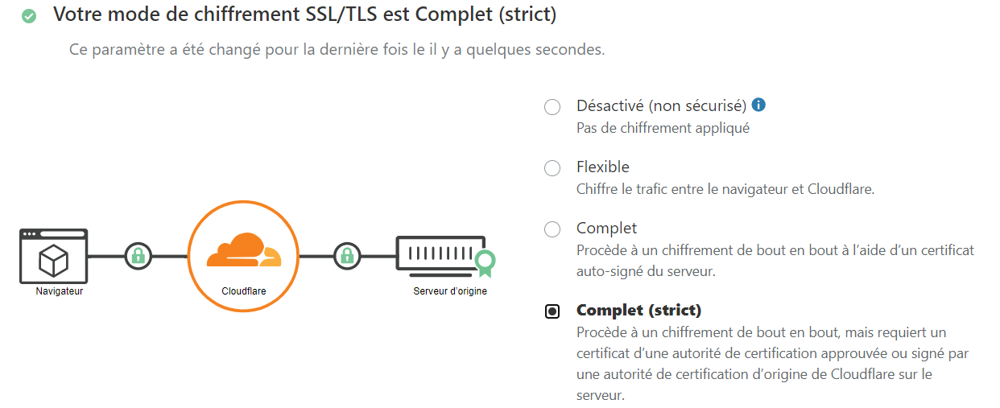

## INTRO

Voici un petit tuto pour utiliser le reverse proxy de cloudflare pour protéger votre installation Home Assistant.  
J'utilise Home Assistant OS, mais je ne pense pas que cela change avec les autres types d'installation.

## OBJECTIF

L'objectif est de publier l'interface de Home Assistant via Cloudflare et de lui laisser gérer les certificats, et au passage 'cacher' son ip.

## ATTENTION

- Le cache Cloudflare est assez agressif. Donc si vous ne comprenez pas pourquoi tel ou tel modification n'est pas prise en compte (en particulier le dev), passer en mode dev sur cloudflare ([link](https://support.cloudflare.com/hc/en-us/articles/200168246-Understanding-Cloudflare-Development-Mode)).

## COMMENT ON FAIT

- Configurer votre router pour publier votre interface sur l'extérieur. Il est obligatoire d'utiliser l'un des ports listés sur le [site cloudflare](https://support.cloudflare.com/hc/fr-fr/articles/200169156-Identification-des-ports-r%C3%A9seau-compatibles-avec-le-proxy-de-Cloudflare), comme 2087 par exemple.  
Cela fonctionne avec 443 mais j'évite d'utiliser ce port standard qui est l'objet de plus d'attaques.

- Créer un compte Cloudflare et enregistrer votre nom de domaine.
- Sur Cloudflare, Dans la partie **DNS**, ajouter une entrée de type A avec le nom que vous voulez (ici `hass`) et l'IP public de votre router

- Sur Cloudflare, dans la partie **SSL/TLS**, choisissez le mode `complet (strict)`. Cela permet de sécuriser la connexion entre le navigateur et cloudflare avec un certificat géré par cloudflare, et également de sécuriser la connection entre cloudflare et votre serveur.

- Toujours dans **SSL/TLS**, aller dans l'onglet **Serveur d'origine** et créer un certificat, laisser les valeurs par défaut et télécharger le certificat. Enregistrer la clé privé dans `/ssl/privkey.pem` et le certificat dans `/ssl/fullchain.pem` sur home assistant.
- Copier le certificat racine RSA de cloudflare dans le fichier `fullchain.pem` à la suite de votre certificart ([voir ici](https://support.cloudflare.com/hc/fr-fr/articles/115000479507#h_30cc332c-8f6e-42d8-9c59-6c1f06650639))
- Modifier `configuration.yaml` pour lui dire d'utiliser votre certificat
```yaml
http:
  ssl_certificate: /ssl/fullchain.pem
  ssl_key: /ssl/privkey.pem
``` 
- On valide la configuration pour être sur, et on redemarre le serveur.
- Ca devrait fonctionner 🤞

## FACULTATIF - NGINX

Cette partie n'est pas forcément necessaire et cela fonctionne bien sans.   
Mais l'utilisation de NGINX permet entre autres de bloquer l'accès en direct depuis l'exterieur (i.e. en contournant Cloudflare), et plus tard de publier d'autres services que HA sans avoir à ouvrir des ports à chaque fois sur le router.    
En gros, c'est mieux avec.

- Installer l'addon officiel **NGINX Home Assistant SSL proxy**
- Créer un fichier `nginx_proxy_default.conf` dans `/share/` avec comme contenu :
```
include /share/cloudflare-only.conf;
```
- Dans ce même repertoire `/share/` copier le fichier disponible [ici](./files/cloudflare-only.conf) avec comme nom `cloudflare-only.conf`.
- Dans la configuration de l'addon NGINX, modifier le domaine pour pointer vers l'entrée DNS sur cloudflare, et activer la config custom (`active: true` ci dessous)
```yaml
domain: hass.mon-hass.io
certfile: fullchain.pem
keyfile: privkey.pem
hsts: max-age=31536000; includeSubDomains
cloudflare: false
customize:
  active: true
  default: nginx_proxy/nginx_proxy_default*.conf
  servers: nginx_proxy/*.conf
```
- Modifier votre `configuration.yaml` pour enlever la config SSL
```yaml
http:
  # ssl_certificate: /ssl/fullchain.pem
  # ssl_key: /ssl/privkey.pem
``` 
- Modifier votre router pour que le port exterieur pointe maintenant sur 443 et non plus sur 8123.
- On redémarre homeassistant
- Maintenant vous pouvez
  - accéder à home asssistant en http en local (sans erreur de certificat) via http://homeassistany:8123
  - accéder depuis l'exterieur en HTTPS via cloudflare qui s'occupe gérer une partie de la sécurité pour vous, via https://hass.mon-hass.io:2087 (le port configuré sur votre routeur)

😁
